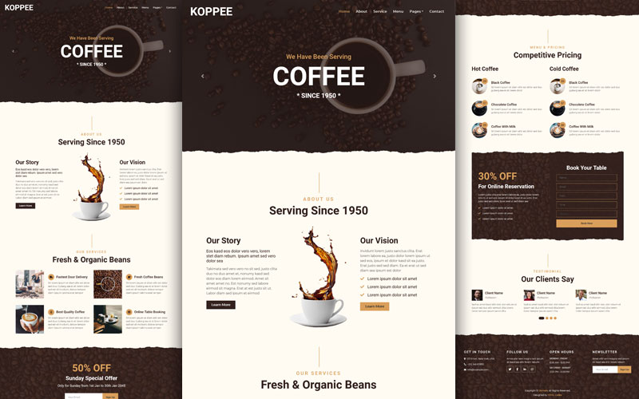
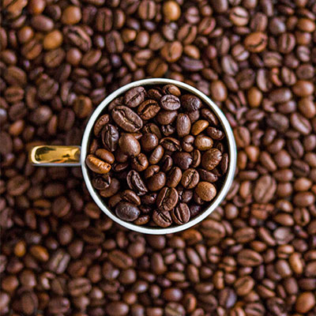

# Morsy Coffee — Coffee Shop Website

A responsive coffee shop website built with Bootstrap 4. Branding, UI/UX enhancements, new home sections, scroll animations, and streamlined assets.

**[Live preview](https://joemo31.github.io/coffee-shop-html-template/)** · [Home](https://joemo31.github.io/coffee-shop-html-template/index.html) · [Menu](https://joemo31.github.io/coffee-shop-html-template/menu.html) · [Contact](https://joemo31.github.io/coffee-shop-html-template/contact.html)

## Previews

| Home (full layout) | Hero carousel |
|:---:|:---:|
|  |  |

| Featured drinks | Café gallery |
|:---:|:---:|
|  |  |

| About section |
|:---:|
|  |

## Pages

| Page | File | Preview |
|------|------|---------|
| Home | `index.html` | [Open](https://joemo31.github.io/coffee-shop-html-template/index.html) |
| About | `about.html` | [Open](https://joemo31.github.io/coffee-shop-html-template/about.html) |
| Services | `service.html` | [Open](https://joemo31.github.io/coffee-shop-html-template/service.html) |
| Menu | `menu.html` | [Open](https://joemo31.github.io/coffee-shop-html-template/menu.html) |
| Reservation | `reservation.html` | [Open](https://joemo31.github.io/coffee-shop-html-template/reservation.html) |
| Testimonials | `testimonial.html` | [Open](https://joemo31.github.io/coffee-shop-html-template/testimonial.html) |
| Contact | `contact.html` | [Open](https://joemo31.github.io/coffee-shop-html-template/contact.html) |

## Features

- Sticky navbar, smooth scroll, skip link, and focus styles
- Scroll-reveal and staggered section animations
- Animated stat counters on the home page
- New sections: coffee process, featured drinks, stats, gallery
- Per-page CSS/JS loading (lighter pages where possible)
- `prefers-reduced-motion` support

## Home page sections

Hero carousel → About → Coffee process → Services → Special offer → Menu → Featured drinks → Reservation → Stats → Gallery → Testimonials → Footer

## Run locally

Open any `.html` file in your browser, or serve the folder:

```bash
npx serve .
```

Contact form submission requires PHP (`mail/contact.php`) on a server that supports PHP mail.

## Structure

- `css/style.min.css` — compiled theme styles
- `css/enhancements.css` — UI/UX improvements (animations, sticky nav, scroll reveal, counters, gallery hovers)
- `js/main.js` — interactions and carousels
- `previews/` — README preview images
- `lib/` — third-party libraries
- `img/` — site images
